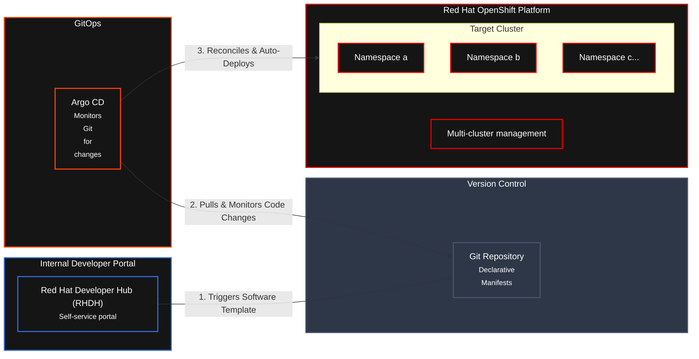

# Module 1  

## Overview     

## Architecture   

## Component

| Component | Description |
| :--- | :--- |
| **Red Hat Developer Hub (RHDH)** | Enterprise-grade developer portal providing convenient access to curated resources and promoting efficiency and collaboration |
| **Openshift** | Target Platform |  
| **Openshift Gitops** | GitOps |

> ## Use Case to explore  
> 
>

## Prerequisites   
>
> Openshift 4.18+ with Gitops, Pipeline, Monitoring Stack, RHDH with Orchestrator
>

## References
[Request Namespace Developer Hub](https://github.com/redhat-ads-tech/rhads-enablement-l3-st-self-service)  
