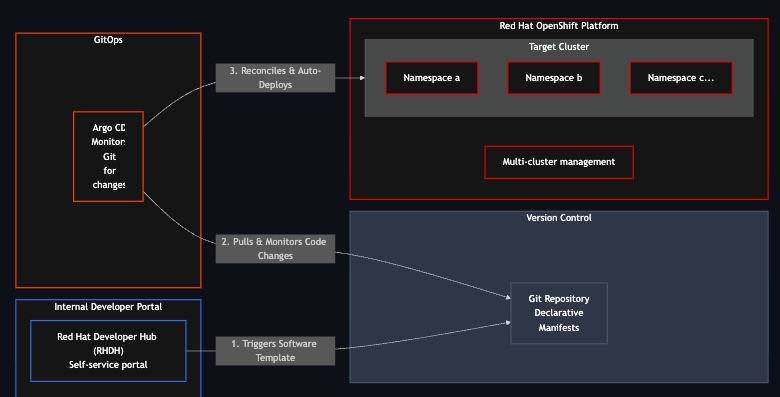
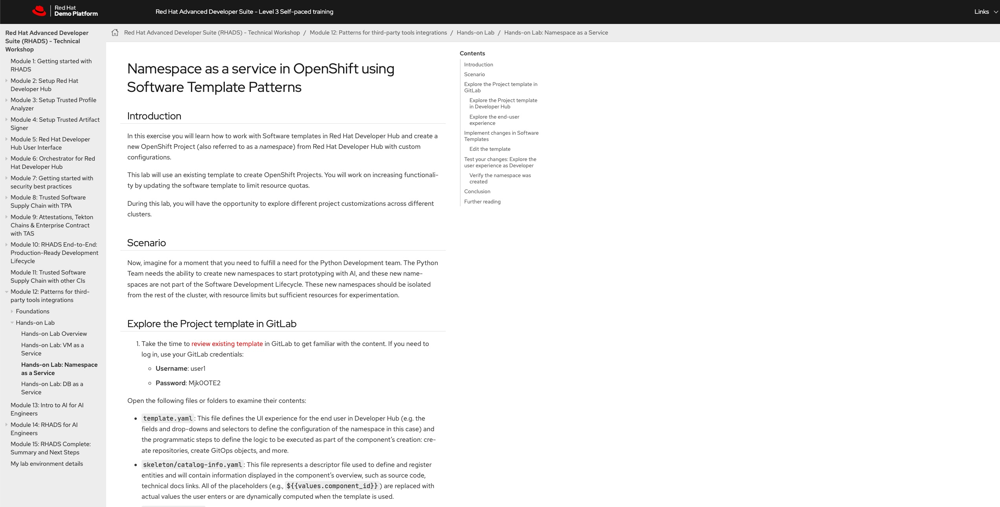

# Declarative Infrastructure  

## Overview

**Welcome to module 1**, this is also the simplest and easiet out of the three.  
This is divided in two parts:  
1. You provision a namespace using software templates in Developer Hub.  
2. You will be a creating a Cluster Roles, Service Accounts and Role Bindings as prepartion for the Module 2 of this workshop.

## Architecture    
  

This has two parts:

!!! note "**Part 1**"

    For this part of the module you will have to use user guide avaible in the showroom link (as shown in the pic).

    Module 12 in the showroom link is the Part 1 of this module.

  

!!! note "**Part 2**"

    **Service Account section**, this is basically prepartion for module 2 in the workshop. you will be using the same OpenShift Cluster.
    

**we working to have an integrate experience and adding Trusted Software Supply chain to this worskhop**

## Component

| Component | Description |
| :--- | :--- |
| **Red Hat Developer Hub (RHDH)** | Enterprise-grade developer portal providing convenient access to curated resources and promoting efficiency and collaboration |
| **OpenShift** | Target Platform |  
| **OpenShift GitOps** | GitOps |

!!! tip "Use Case to explore - Not part of the workshop"

    1. VM as a Service

    2. DB as a Service (Data Grid)

## Further Reading
[Red Hat Advance Developer Suite](https://www.redhat.com/en/products/advanced-developer-suite)
