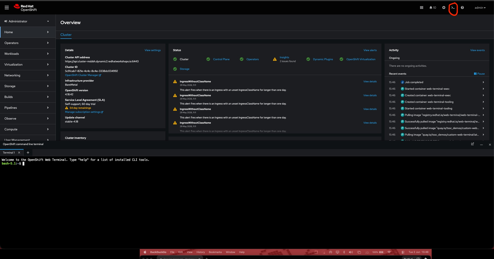

# Setting up Machine Identity - Service Account

The Service Accounts created here belong to the cluster configuration layer, not the EDA layer.  
But it’s a prerequisite for Module 2 — without it, EDA cannot connect to OpenShift.

!!! question "Why a dedicated Service Account?"
 
    EDA runs outside the cluster (on AAP).
    
    It needs a persistent, non-expiring token to maintain the event stream.

!!! question "What gets Created?"

    ServiceAccount        → the identity
    
    ClusterRole           → what it's allowed to do 
    
    ClusterRoleBinding    → connects identity to permissions
    
    Token Secret          → the bearer token EDA uses to authenticate

## Clone this Repo  

**Let's clone this repo - we don't have to write yamls**  

You should already logged in into your target Openshift Cluster  

1. Start a web terminal (as shown in pic)  
    

2. Git clone  
  ```bash
  bash-5.1:~$ git clone https://github.com/niksharma20/Continuous-Delivery-Engine.git
  
  ```

3. Change directory to module 1  
  ```bash
  cd Continuous-Delivery-Engine/docs/content/modules/module_1/
  ```

4. Create namespace aap  
   ```bash
   # Create the namespace first if it doesn't exist
       oc create namespace aap
   ```

## Create OpenShift Service Account for EDA  

### Step 1  
**Create the ClusterRole** [01_eda-clusterrole.yaml](https://raw.githubusercontent.com/niksharma20/Continuous-Delivery-Engine/refs/heads/main/docs/content/modules/module_1/eda-ocp-sa/01_eda-clusterrole.yaml)  

  ```bash
  oc apply -f eda-ocp-sa/01_eda-clusterrole.yaml
  ```  
### Step 2   
**Create the ServiceAccount** [02_eda-serviceaccount.yaml](https://raw.githubusercontent.com/niksharma20/Continuous-Delivery-Engine/refs/heads/main/docs/content/modules/module_1/eda-ocp-sa/02_eda-serviceaccount.yaml)  

  ```bash
  # Create the ServiceAccount
  oc apply y -f eda-ocp-sa/02_eda-serviceaccount.yaml
  ```
### Step 3  
**Bind the ServiceAccount to the ClusterRole** [03_eda-rolebinding.yaml](https://raw.githubusercontent.com/niksharma20/Continuous-Delivery-Engine/refs/heads/main/docs/content/modules/module_1/eda-ocp-sa/03_eda-rolebinding.yaml)  

  ```bash
  oc apply -f eda-ocp-sa/03_eda-rolebinding.yaml
  ```  
### Step 4   
**Generate a Persistent Long-Lived Token** [04_eda-token-secret.yaml](https://raw.githubusercontent.com/niksharma20/Continuous-Delivery-Engine/refs/heads/main/docs/content/modules/module_1/eda-ocp-sa/04_eda-token-secret.yaml)  

  ```bash
  oc apply -f eda-ocp-sa/04_eda-token-secret.yaml
  ```  
### Step 5  
**Extract the Token**

Once the Secret is created, extract and decode the token for use in AAP:

  ```bash
  oc get secret eda-token-secret -n aap \
    -o jsonpath='{.data.token}' | base64 --decode
  ```

**Copy the output. You will need it later for creating EDA credential in the next section.**


## Create OpenShift Service Account for Automation Controller  

### Step 1  
**Create the ClusterRole** [01_aac-clusterrole.yaml](https://raw.githubusercontent.com/niksharma20/Continuous-Delivery-Engine/refs/heads/main/docs/content/modules/module_1/aac-ocp-sa/01_aac-clusterrole.yaml)

  ```bash
  oc apply -f aac-ocp-sa/01_aac-clusterrole.yaml
  ```

### Step 2   
**Create the ServiceAccount** [02_aac-serviceaccount.yaml](https://raw.githubusercontent.com/niksharma20/Continuous-Delivery-Engine/refs/heads/main/docs/content/modules/module_1/aac-ocp-sa/02_aac-serviceaccount.yaml)

  ```bash
  # Create the ServiceAccount
  oc apply -f aac-ocp-sa/02_aac-serviceaccount.yaml
  ```

### Step 3  
**Bind the ServiceAccount to the ClusterRole** [03_aac-rolebinding.yaml](https://raw.githubusercontent.com/niksharma20/Continuous-Delivery-Engine/refs/heads/main/docs/content/modules/module_1/aac-ocp-sa/03_aac-rolebinding.yaml)

  ```bash
  oc apply -f aac-ocp-sa/03_aac-rolebinding.yaml
  ```

### Step 4  
**Generate a Persistent Long-Lived Token** [04_aac-token-secret.yaml](https://raw.githubusercontent.com/niksharma20/Continuous-Delivery-Engine/refs/heads/main/docs/content/modules/module_1/aac-ocp-sa/04_aac-token-secret.yaml)

  ```bash
  oc apply -f aac-ocp-sa/04_aac-token-secret.yaml
  ```

### Step 5   
Extract the Token

Once the Secret is created, extract and decode the token for use in AAP:

```bash
oc get secret aac-token-secret -n aap \
  -o jsonpath='{.data.token}' | base64 --decode
```

**Copy the output. You will need it later for creating EDA credential in the next section.**

!!! important "Two Service Accounts"

    1. eda-service-account: observes — read only, never touches resources

    2. aac-service-account: read/write, makes changes to resources

    Two separate identities, two separate permission sets, two separate purposes. 
    The principle of least privilege applied in practice.

    
!!! success "Congratulations!"
    You have successfully completed this section.
    Continue to the next page using the **Next** button below.
