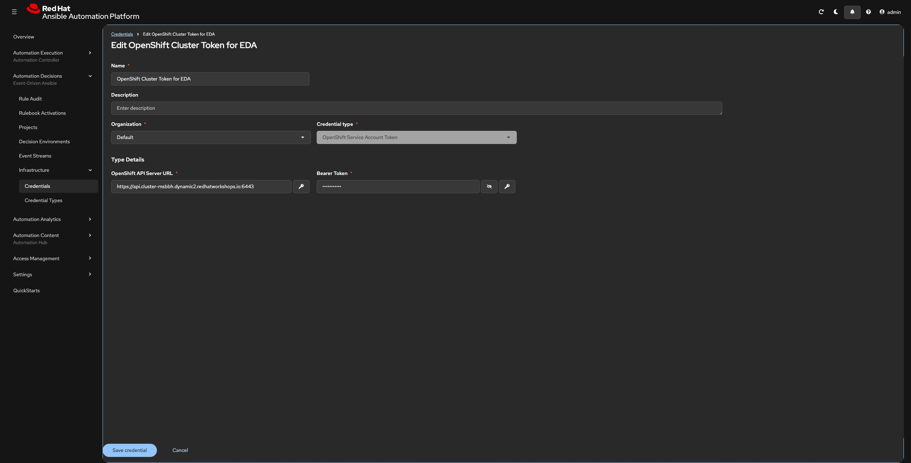
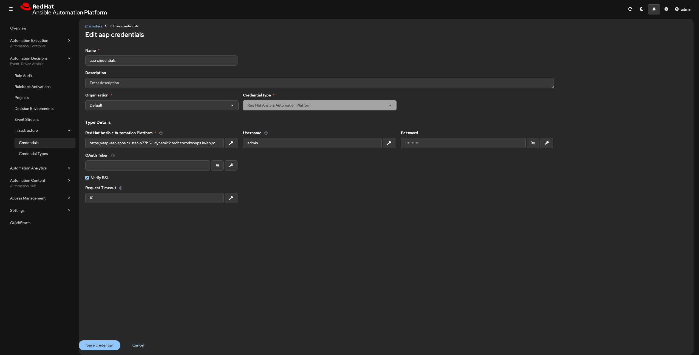
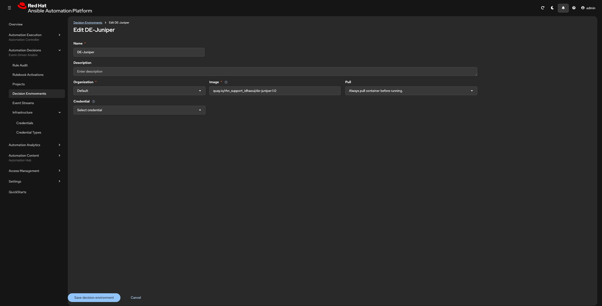
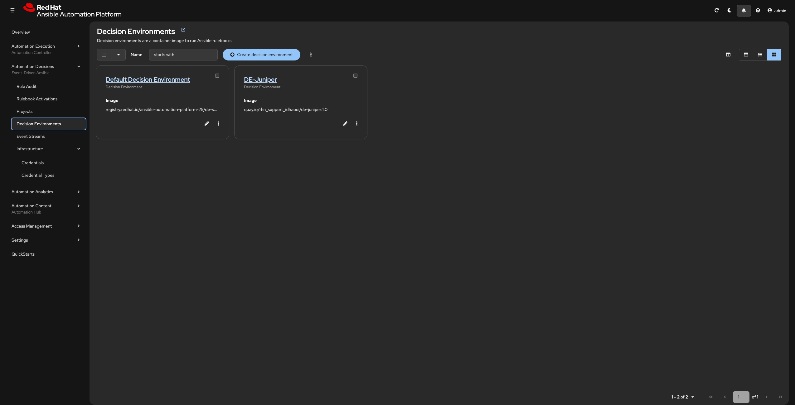

# Overview  
This is moment when you define credentials needed by the execution enviroment to authenticate against the Target Openshift Cluster.

Credentials in AAP are never exposed in plaintext to rulebooks — they are injected at runtime via file projection or environment variables, depending on the credential type.

## Credential Type 


## Credentials  

|System                       |Why                                                    |Credential Type                    |Details                    |
|-----------------------------|-------------------------------------------------------|-----------------------------------|-----------------------------------
|OpenShift                    |To stream cluster events via the Juniper k8s.eda plugin|OpenShift Service Account Token  |OpenShift Service Account Token|
|Ansible Automation Controller|To fire job templates when a rulebook rule matches     |Red Hat Ansible Automation Platform|aap credentials |

```
These are configured separately and both assigned to the same Rulebook Activation.
```  
>
> ### Prerequisites  
> Before you start you need:  
> 1) The OpenShift cluster API URL.   
>      `oc whoami --show-server`  
> 2) The decoded bearer token from the EDA ServiceAccount.  
>       `oc get secret eda-token-secret -n aap -o jsonpath='{.data.token}' | base64 --decode`  
> 3) Red Hat Ansible Platform Host url and Credentials
> 

### Openshift
**Step1:** Log in to AAP  
**Step2:** Navigate to Credentials
```
Automation Decisions → Credentials → Create Credential
```  
**Step3:** Fill in the Credential Form (like below)  
```
Name: OpenShift Cluster Token for EDA
Organization: Default
```  
```
Credential Type: Click the dropdown menu and select OpenShift Service Account Token
```  
```
API Server URL: https://api.<your-cluster-domain>:6443 (this is part of the Prerequisites).
Bearer Token: (this is part of the Prerequisites)
```  
```
Verify SSL: On
```  


### AAC
**Step1:** Navigate to Credentials
```
Automation Decisions → Credentials → Create Credential
```  
**Step2:** Fill in the Credential Form (like below)  
```
Name: aap credentials
Organization: Default
```  
```
Credential Type: Red Hat Ansible Automation Platform
```  
```
Red Hat Ansible Platform: https://aap-aap.apps.<your-cluster-domain> (this is part of the Prerequisites).
Username: admin
Password: (this is part of the Prerequisites)
```  
```
Verify SSL: On
```  


## Decision Environment  

Creating the Decision Environment in AAP
> Prerequisites
> The custom DE image built and pushed to your registry
> Registry credentials if your registry requires authentication or make the image public.
> 

**Step1:** Navigate to Decision Environments  
```
Automation Decisions → Decision Environments → Create Decision Environment
```  
**Step2:** Fill in the Form (like below)  
```
Name: DE-Juniper
Organization: Default
```  
```
Image: quay.io/rhn_support_idhaoui/de-juniper:1.0 ( This public image, custom built for the workshop)
```  
```
Pull: Always pull container before running
```  
```
Verify SSL: On
```  
  

  

-----
### Important Collections part DE Image

|Collection                              |Purpose                                                                                                      |
|----------------------------------------|-------------------------------------------------------------------------------------------------------------|
|`ansible.eda`                         |Core EDA event sources and filters (webhook, kafka, alertmanager, etc).|
|`community.general`                     |General-purpose Ansible modules used in rulebook actions|
|`juniper.eda.k8s`|Kubernetes/OpenShift event source plugin — streams `ADDED`, `MODIFIED`, `DELETED` events from the cluster API|


### Python dependencies part DE Image

|Package             |Purpose                                                                                                                                  |
|--------------------|-----------------------------------------------------------------------------------------------------------------------------------------|
|`aiokafka`          |Async Kafka client — used by `ansible.eda` Kafka event source                                                                            |
|`aiohttp`           |Async HTTP client — used by webhook and HTTP-based event sources                                                                         |
|`watchdog`          |File system event monitoring                                                                                                             |
|`kubernetes_asyncio`|**Critical** — async Python client for the Kubernetes API; required by the Juniper k8s event source to open and maintain the event stream|


> 
> `kubernetes_asyncio` is the most critical Python dependency. Without it, the Juniper plugin cannot establish the async WebSocket connection to the OpenShift API and the rulebook will fail to start.
> 
-----