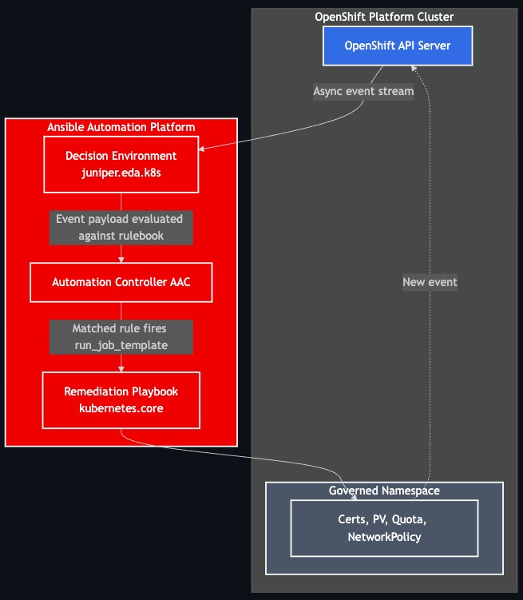

# Event Driven Ansible for OpenShift  

## Overview 
**Welcome to module 2**, in this module you will configure the Event-Driven Ansible (EDA) governance layer for OpenShift. 
By the end of this module, EDA will be watching your governed namespaces in real time and automatically triggering remediation playbooks via Ansible Automation Controller when cluster state drifts from the desired state.  
This module is also divided in two parts:  
1. Event Driven Ansible (EDA) : Decision Environment  
2. Ansible Automation Execution: Automation Controller  

## Architecture

!!! warning "Prerequisites"

    1. **Environment 1 — Ansible Automation Platform (AAP)**
    Provides Automation Controller (AAC) and Automation Decisions (EDA).
    **Ansible 2.6 with EDA**  

    2. OpenShift Service Accounts , created in the previous module.  

## Component

| Component | Description |
| :--- | :--- |
| **Openshift** | Target Platform |
| **Ansible Automation Platform** | Automation Controller |
| **Event Driven Ansible** | Automation Decisions |  

## References
[Event Driven Ansible for Openshift](https://github.com/redhat-ads-tech/rhads-enablement-l3-st-self-service)  
[Demo Event Driven Ansible by Andrew Block](https://redhat-gpte-devopsautomation.github.io/showroom-demo-event-driven-ansible/modules/index.html)
[Kubernetes Collection for Ansible](https://catalog.redhat.com/en/software/collection/kubernetes/core#documentation)
[Ansible Event Driven Automation by Juniper](https://catalog.redhat.com/en/software/collection/juniper/eda)
[Ansible Rulebooks](https://github.com/shadowman-lab/Ansible-Rulebooks/tree/main/rulebooks)
[Paulo Menon](https://github.com/paulomenon/ansible-practical-examples/tree/main/day-to-day-work-examples)
