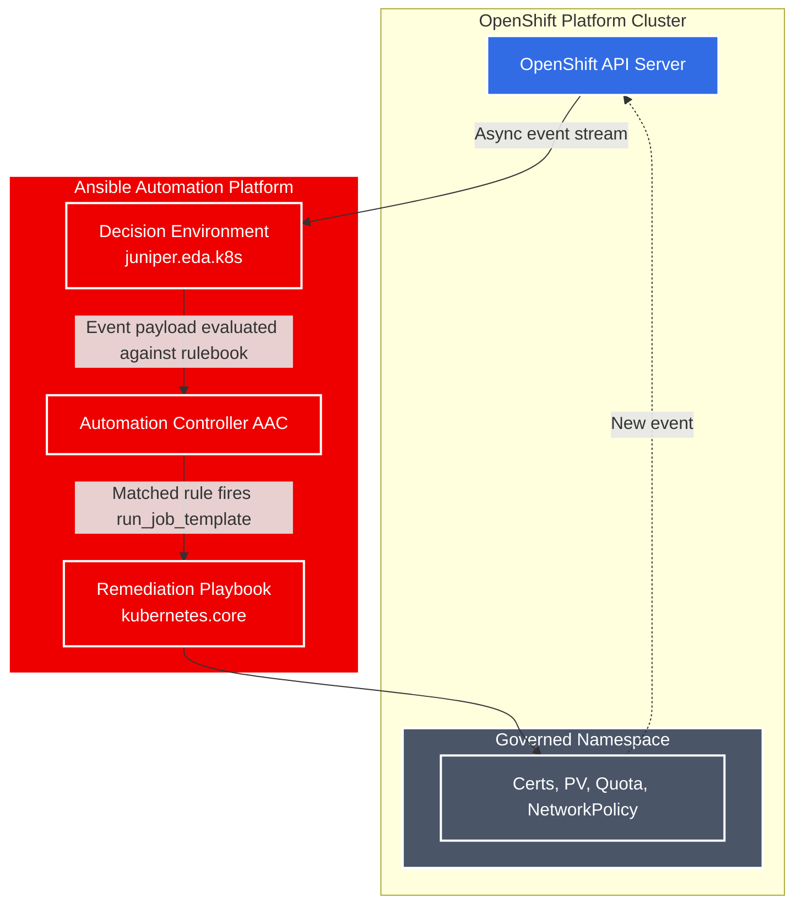

# Module 2  

## Overview     

## Architecture  

## Component

| Component | Description |
| :--- | :--- |
| **Openshift** | Target Platform |
| **Ansible Automation Platform** | Automation Controller |
| **Event Driven Ansible** | Automation Decisions |  

## Use Case to explore  
> 
>

## Prerequisites   
>
> 
>

## References
[Event Driven Ansible for Openshift](https://github.com/redhat-ads-tech/rhads-enablement-l3-st-self-service)  
[Demo Event Driven Ansible by Andrew Block](https://redhat-gpte-devopsautomation.github.io/showroom-demo-event-driven-ansible/modules/index.html)
[Kubernetes Collection for Ansible](https://catalog.redhat.com/en/software/collection/kubernetes/core#documentation)
[Ansible Event Driven Automation by Juniper](https://catalog.redhat.com/en/software/collection/juniper/eda)
[Ansible Rulebooks](https://github.com/shadowman-lab/Ansible-Rulebooks/tree/main/rulebooks)
[Paulo Menon](https://github.com/paulomenon/ansible-practical-examples/tree/main/day-to-day-work-examples)
