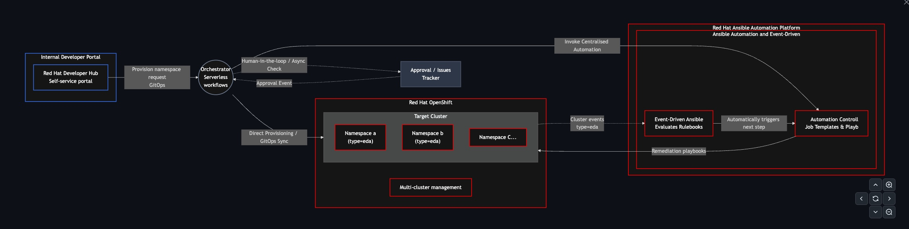
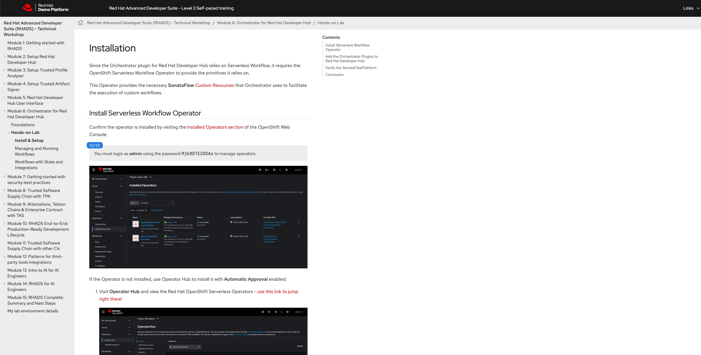
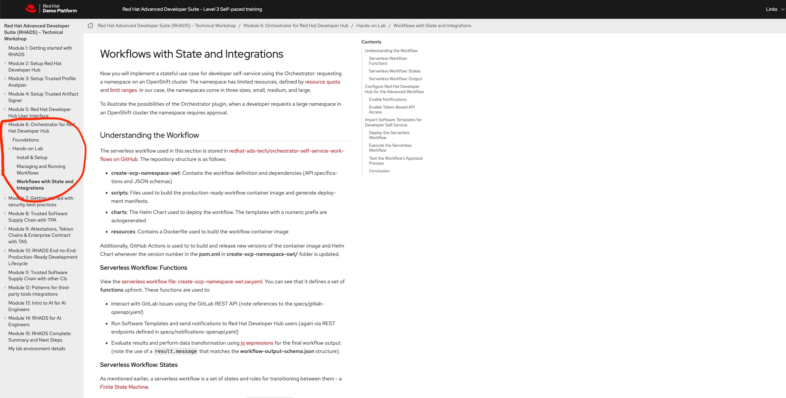

# Enforcing Governance via IDP  

## Overview  

**Welcome to module 3**, this is final module of the workshop and also everything comes together.  
This is divided in three parts:  
1. You will be setting **Orchestrator** (serverless workflow component).   
2. Deploy Namespace as a Service serverless worklow with **human in the loop** integration.  
3. You will be a editing software tempaltes in the gitlab and provisioning a namespace with **EDA Goverance** enabled.  

## Architecture  

!!! note "**Part 1**"

    For this part of the module you will have to use user guide available in the showroom link (as shown in the pic).

    **Module 6 - Install & Setup**  in the showroom link is the Part 1 of this module.
    Feel to read through the **Foundations** section shown in the pic.

  

!!! note "**Part 2**"

    For this part of the module you will have to use the user guide available in the showroom link (as shown in the pic).

    **Module 6 - Workflows with State and Integrations** in the showroom link is the Part 2 of this module.
    Feel to try through the **Managing and Running Workflows** section shown in the pic. It is not mandoatory for the workshop though.

 

!!! note "**Part 3**"

    For this part of the module you will executing the procedures in *Namespace Governance* section.

**we working to have an integrate experience and adding Trusted Software Supply chain to this worskhop**  

## Component

| Component | Description |
| :--- | :--- |
| **Red Hat Developer Hub (RHDH)** | Enterprise-grade developer portal providing convenient access to curated resources and promoting efficiency and collaboration |
| **Orchestrator** | Serverless Workflow |
| **Ansible Automation Platform** | Automation Controller | 
| **Event Driven Ansible** | Automation Decisions | 
| **OpenShift** | Target Platform |
| **OpenShift GitOps** | GitOps | 
| **GitHub** | Issue tracker for approval workflows (Jira or ServiceNow in production)|  

!!! success "Congratulations!"
    You have successfully completed this section.
    Continue to the next page using the **Next** button below.

## References
[Event Driven Ansible for OpenShift](https://github.com/redhat-ads-tech/rhads-enablement-l3-st-self-service)  
[RHDH Advanced Workflows](https://github.com/redhat-ads-tech/rhads-enablement-l3/tree/main/content/modules/ROOT/pages/rhdh-orchestrator)
[RHDH Serverless Workflow](https://github.com/rhdhorchestrator/serverless-workflows)
