# Enforcing Governance via IDP  

## Overview  

## Architecture  

```mermaid
graph LR
    %% Color Palette Configurations
    classDef rhdh fill:#151515,stroke:#326ce5,stroke-width:2px,color:#fff;
    classDef aap fill:#151515,stroke:#ee0000,stroke-width:2px,color:#fff;
    classDef ocp fill:#151515,stroke:#ee0000,stroke-width:2px,color:#fff;
    classDef external fill:#2d3748,stroke:#4a5568,stroke-width:2px,color:#fff;
    classDef workflow fill:#151515,stroke:#718096,stroke-width:2px,color:#fff;

    %% --- LEFT COLUMN: REQUEST & ORCHESTRATION ---
    subgraph Portal_Layer [Internal Developer Portal]
        RHDH["Red Hat Developer Hub<br><small>Self-service portal<br></small>"]
    end
    class Portal_Layer,RHDH rhdh;

    Orchestrator(("Orchestrator<br><small>Serverless<br>workflows</small>"))
    Tracker["Approval / Issues<br>Tracker"]
    class Orchestrator workflow;
    class Tracker external;

    %% --- MIDDLE COLUMN: AUTOMATION PLATFORM ---
    subgraph AAP [Red Hat Ansible Automation Platform]
        subgraph AAP_Core ["AAC and EDA"]
            Controller["Job Templates & Playbooks"]
            EDA["Evaluates Rulebooks"]
        end
    end
    class AAP_Core,Controller,EDA aap;

    %% --- RIGHT COLUMN: INFRASTRUCTURE & MANAGED ENVIRONMENT ---
    subgraph OCP_Layer [Red Hat OpenShift]
        subgraph Target_Clusters [Target Cluster]
            Na["Namespace a<br>(type=eda)"]
            Nb["Namespace b<br>(type=eda)"]
            Nc["Namespace C..."]
        end
        MCM["Multi-cluster management"]
    end
    class OCP_Layer,Target_Clusters,Na,Nb,Nc,MCM ocp;

    %% --- RELATIONSHIPS & FLOW LINES ---
    RHDH -->|Provision namespace request<br>GitOps| Orchestrator
    Orchestrator -.->|Human-in-the-loop / Async Check| Tracker
    Tracker -.->|Approval Event| Orchestrator
    
    Orchestrator -->|Invoke Centralised Automation| Controller
    
    %% Added direct orchestration to cluster line
    Orchestrator -->|Direct Provisioning / GitOps Sync| Target_Clusters
    
    %% Event Stream Loop
    Target_Clusters -.->|Cluster events<br>type=eda| EDA
    EDA -->|Automatically triggers next step| Controller
    Controller -->|Remediation playbooks| Target_Clusters
```

## Component

| Component | Description |
| :--- | :--- |
| **Red Hat Developer Hub (RHDH)** | Enterprise-grade developer portal providing convenient access to curated resources and promoting efficiency and collaboration |
| **Orchestrator** | Serverless Workflow |
| **Ansible Automation Platform** | Automation Controller | 
| **Event Driven Ansible** | Automation Decisions | 
| **Openshift** | Target Platform |
| **Openshift Gitops** | GitOps | 
| **GitHub** | Ticket Automation (Here we are using a Git but in real env it would be Jira or Service Now) |  

## Use Case to explore  
> 
>

## Prerequisites   
>
> 
>

## References
[Event Driven Ansible for Openshift](https://github.com/redhat-ads-tech/rhads-enablement-l3-st-self-service)  
[RHDH Advanced Workflows](https://github.com/redhat-ads-tech/rhads-enablement-l3/tree/main/content/modules/ROOT/pages/rhdh-orchestrator)
[RHDH Serverless Workflow](https://github.com/rhdhorchestrator/serverless-workflows)
