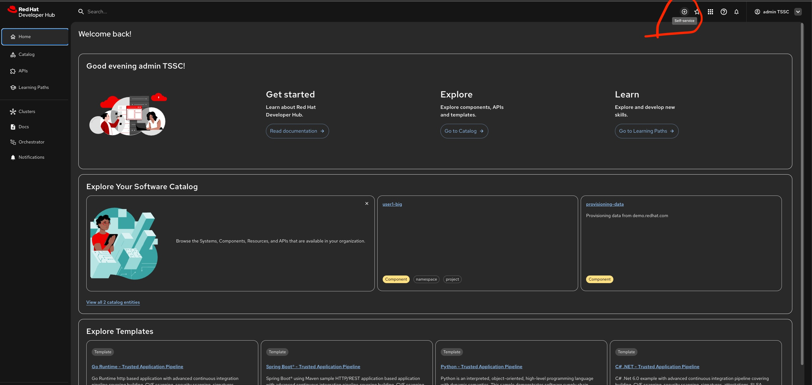
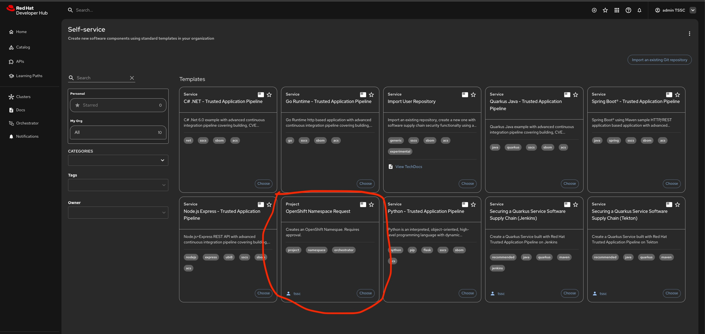
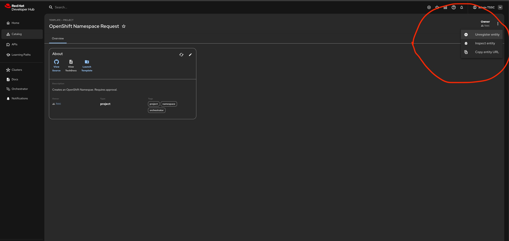
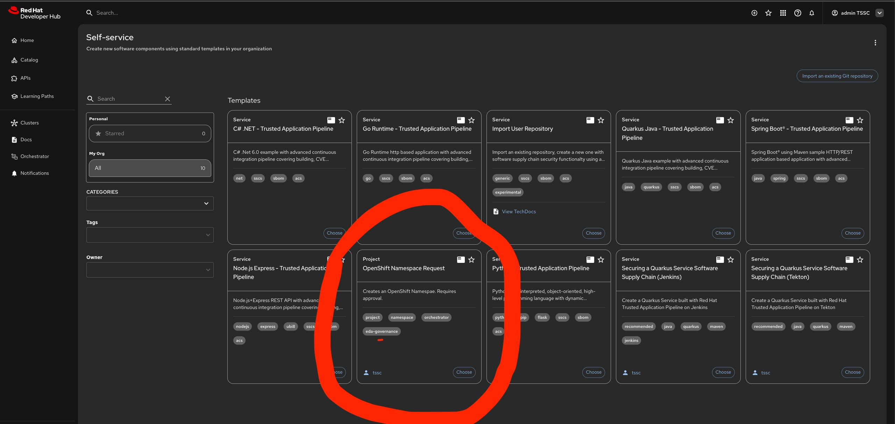
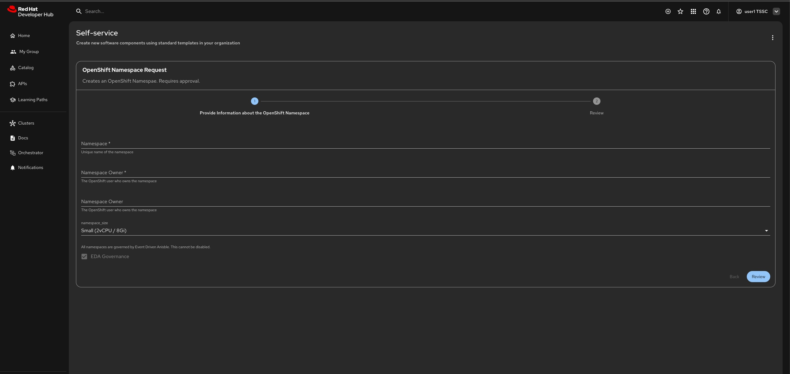
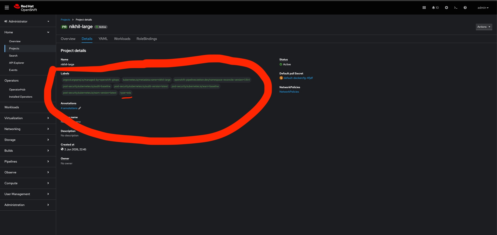
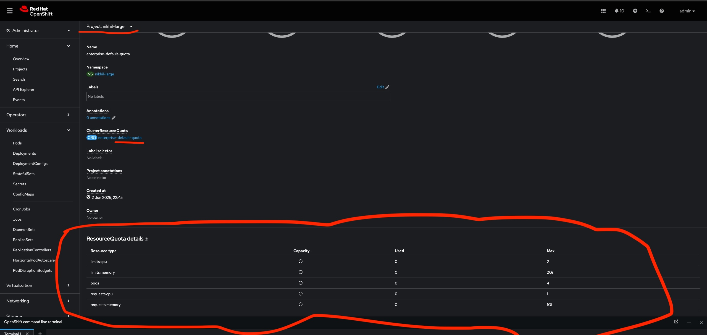
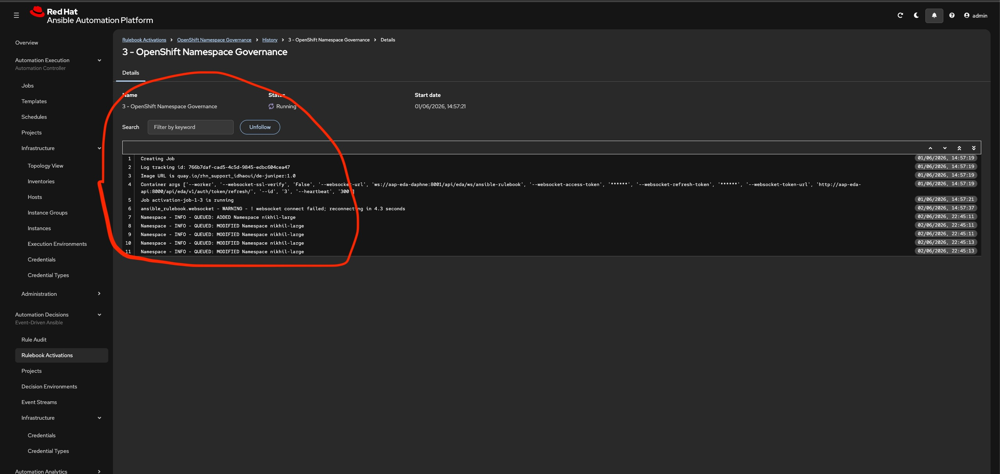
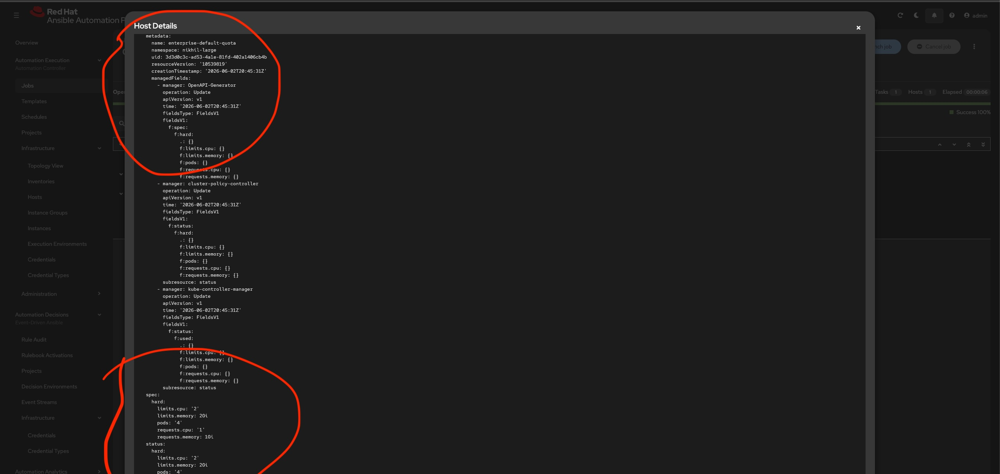

# EDA-Enabled Namespace Provisioning

## Overview  

**Welcome to the last section of the workshop**, by now you should have good idea of the Developer Hub UI.

In this section, we will `unregister the OpenShift Namespace Request` software template from the Developer Hub UI.
Then import a new software template which will extend the namespace request workflow by enabling Event-Driven Ansible (EDA) governance on a namespace at provisioning time.
Provision a **small/medium/large** namespace and with **Enable EDA Governance** option, the workflow applies a label to the namespace:  

```
type: "eda"
```  
This label acts as a signal to the Event Driven Ansible. The `juniper.eda.k8s` collection watches the cluster for events on labelled namespaces and triggers Ansible Automation Controller job templates in response to ADDED, MODIFIED events on labelled namespaces.

!!! warning "Prerequisites"

    ✅ **Module 1, Part 2 - completed successfull**  
    ✅ **Module 2         - completed successfull**  
    ✅ **Module 3, Part 1 - completed successfully**  
    ✅ **Module 3, Part 2 - completed successfully**  


## Unregister Software Template
 **Step 1:**  
    ```Login to Red Hat Developer Hub as the admin user``` 
  

**Step 2:**  
    ```Click the self-service icon (the + plus) in the top-right corner of the UI```
  

**Step 3:**
    ```Unregister the Software Template by clicking menu in the top-right corner of the UI```  
  

## Register a new template  

**Step 1:** 
    ```You are already logged Red Hat Developer Hub as the admin user```  

**Step 2:** 
    ```Click the self-service icon (the + plus) in the top-right corner of the UI.```  

**Step 3:**
    ```Click the Import an existing Git repository button.```  

**Step 4:**    
    ```Enter the following URL in the Select URL field and click Analyze```  
    ```https://github.com/niksharma20/orchestrator-self-service/blob/main/namespace/template.yaml```  

**Step 5:**
    ```Click Import when prompted```  

**Step 6:**
    ``` Select the self-service icon (the + plus) icon on the top navigation bar, then filter by setting the Tags to orchestrator to see the new template.```
  

**Step 7:**
    ```Verify the Software template for **EDA Governance** checkbox, it has been disabled on purpose to enfore Governance ```  
  

## Provision a new namespace with EDA Governance

**Step 1:** 
    ```Before proceeding, logout of Red Hat Developer Hub as the admin and login as user1 ```  
    ```Select the Orchestrator item in the left-hand menu of Red Hat Developer Hub.```  
    
**Step 2:** 
    ```Click on the Create OpenShift Namespace workflow.```

**Step 3:**  
    ```Click on the Run button at the top right of the screen to start an instance of the workflow.```

**Step 4:**  
    ```You are presented with a form to enter the details of your request. Let’s start with a request for a large namespace. Fill in the form as follows:```  
    ```
    Namespace name: <yourname>-large  
    GitLab Host: <Gitlab host name used previously in the part 2 of the module>  
    Requester: user1  
    Size: large  
    Reason: you can leave this blank  
    Recipients: user:default/user1  
    ```

**Step 5:**  
    ```Click on Next and Run to start the workflow.```  

**Step 6**  
    ```Select the Notifications item in the left-hand menu. After a couple of seconds you will see a notification that an issue has been created in GitLab.```  

**Step 7**  

    ```Click on the link of the notification. This opens the issue in GitLab.  
       Same as previous part in the module, approve the request.  
       Make sure you are logged in into GitLab as root, password as mentioned in the part of the module.
    ```  

**Step 8**
    ``` Verify the namespace label in OpenShift and Ansible Automation Platform ```  

```OpenShift Namespace Label```  
  

```OpenShift Namespace Resource Quoata```
  

```EDA Rulebook History verification```
  

```Automation Controller Job verification```
  


!!! success "Congratulations!"
    You have successfully completed this section.
    Let's check Conclusion