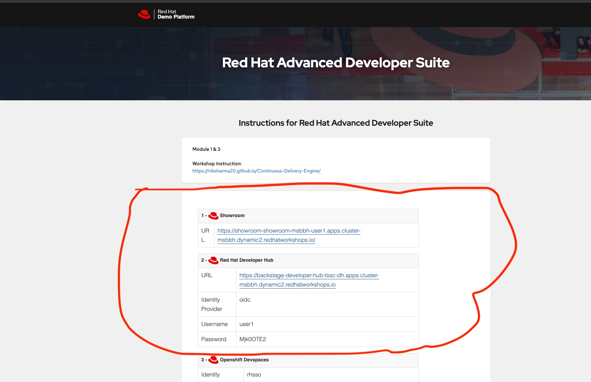
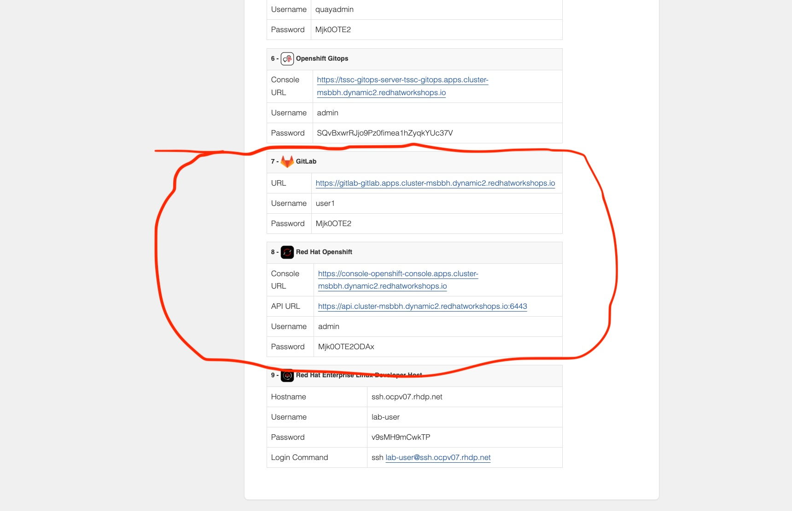
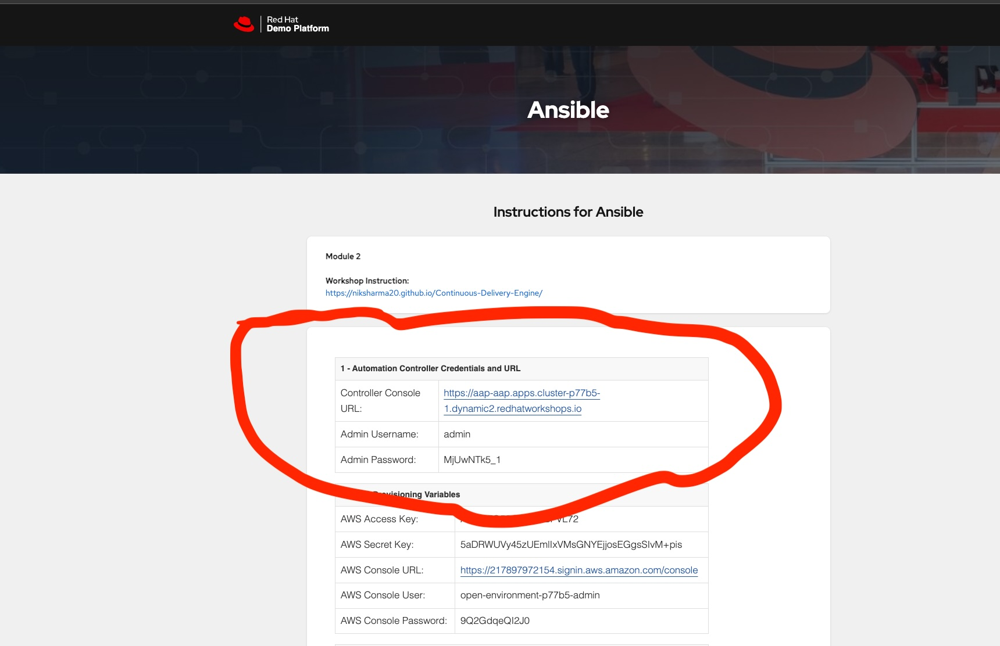

# Workshop Architecture Note

Following a real world architecture, the workshop is deployed with clear separation. 
Ansible Automation Platform is deployed in a completly separate environment is outside of the Target OpenShift Cluster.
A centralised AAP instance governing multiple OpenShift clusters is exactly how enterprise customers deploy it.  

!!! info "Deployment Model"
    AAP and OpenShift run as **separate, independent deployments**.

    - **AAP** — hosts Automation Controller and EDA Decision Controller
    - **OpenShift (RHADS)** — target cluster running RHDH, Orchestrator, GitOps, and workloads

    EDA authenticates to OpenShift remotely via a ServiceAccount bearer token.  
    This reflects a real-world enterprise model where a centralised AAP instance
    governs multiple OpenShift clusters.

## Workshop Landing Page  

 This workshop uses **two separate environments** — both need separate assignment.  

  

!!! warning "Prerequisites"

    **Environment 1 — Ansible Automation Platform (AAP)**
    Provides Automation Controller (AAC) and Automation Decisions (EDA).
    **Ansible 2.6 with EDA**

    **Environment 2 — OpenShift (RHADS)**
    Target cluster with GitOps, Pipelines, Monitoring Stack, and RHDH with Orchestrator pre-installed.
    **OpenShift 4.18+ with RHDH**

    > AAP lives **outside** the OpenShift cluster — this is intentional.  
    > EDA connects to OpenShift remotely using a ServiceAccount bearer token.  

## RHADS Request Page

  

Once you have put in email id (this is just assignment purpose)  
You will see below, you will need the things in marked in red circles.  

  

  

>  Please open below in separate browser tab  
>  1. Showroom url, please keep it open in a separate tab  
>  2. Red Hat Developer Hub details, please keep it open in a separate tab  
>  3. GitLab details, please keep it open in a separate tab  
>  4. Red Hat OpenShift, this is your Target OpenShift Cluster  

## Ansible Request Page
  

Once you have put in email id (this is just assignment purpose)  
You will see below, you will need the things in marked in red circles.  

  

>  Please open below in seperate brower tab  
>  1. Automation Controller Credentials and URL, please keep it open in a separate tab  

!!! success "Congratulations!"
    You have successfully completed this section.
    [Next: Module 1 →](../modules/module_1/module1.md){ .md-button .md-button--primary }
