# Continuous Delivery Engine: Hands-On Technical Workshop   
## Architecture  
Building Continuous Delivery Pattern using Developer Hub, Serverless Workflows, OpenShift and Event Driven Ansible.  

```mermaid
graph LR
    %% Color Palette Configurations
    classDef rhdh fill:#151515,stroke:#326ce5,stroke-width:2px,color:#fff;
    classDef aap fill:#151515,stroke:#ee0000,stroke-width:2px,color:#fff;
    classDef ocp fill:#151515,stroke:#ee0000,stroke-width:2px,color:#fff;
    classDef external fill:#2d3748,stroke:#4a5568,stroke-width:2px,color:#fff;
    classDef workflow fill:#151515,stroke:#718096,stroke-width:2px,color:#fff;

    %% --- LEFT COLUMN: REQUEST & ORCHESTRATION ---
    subgraph Portal_Layer [Internal Developer Portal]
        RHDH["Red Hat Developer Hub<br><small>Self-service portal<br></small>"]
    end
    class Portal_Layer,RHDH rhdh;

    Orchestrator(("Orchestrator<br><small>Serverless<br>workflows</small>"))
    Tracker["Approval / Issues<br>Tracker"]
    class Orchestrator workflow;
    class Tracker external;

    %% --- MIDDLE COLUMN: AUTOMATION PLATFORM ---
    subgraph AAP [Red Hat Ansible Automation Platform]
        subgraph AAP_Core ["AAC and EDA"]
            Controller["Job Templates & Playbooks"]
            EDA["Evaluates Rulebooks"]
        end
    end
    class AAP_Core,Controller,EDA aap;

    %% --- RIGHT COLUMN: INFRASTRUCTURE & MANAGED ENVIRONMENT ---
    subgraph OCP_Layer [Red Hat OpenShift]
        subgraph Target_Clusters [Target Cluster]
            Na["Namespace a<br>(type=eda)"]
            Nb["Namespace b<br>(type=eda)"]
            Nc["Namespace C..."]
        end
        MCM["Multi-cluster management"]
    end
    class OCP_Layer,Target_Clusters,Na,Nb,Nc,MCM ocp;

    %% --- RELATIONSHIPS & FLOW LINES ---
    RHDH -->|Provision namespace request<br>GitOps| Orchestrator
    Orchestrator -.->|Human-in-the-loop / Async Check| Tracker
    Tracker -.->|Approval Event| Orchestrator
    
    Orchestrator -->|Invoke Centralised Automation| Controller
    
    %% Added direct orchestration to cluster line
    Orchestrator -->|Direct Provisioning / GitOps Sync| Target_Clusters
    
    %% Event Stream Loop
    Target_Clusters -.->|Cluster events<br>type=eda| EDA
    EDA -->|Automatically triggers next step| Controller
    Controller -->|Remediation playbooks| Target_Clusters
```

This hands-on comprehensive workshop provides technical understanding of Continuous Delivery Engine (CDE) components and their implementation.  
Designed for platform engineers, DevOps practitioners, and technical leaders.  

In this workshop you will build and experience a Continuous Delivery Engine using Red Hat Developer Hub and Ansible Automation Platform that delivers to containers, VMs, and other infrastructure components through a single, automated, policy-enforced pipeline — no environment left behind. Red Hat Developer Hub serves as the self-service abstraction layer; Ansible Automation Platform serves as the cross-platform automation engine. You will learn how to empower developers with a unified self-service experience while maintaining total operational control.  

> # **Workshop Goal**
>  Build, Show, and Experience the integration between OCP, Ansible, and EDA. Users can take home this setup and explore different use cases.  
>  Today we will explore a simple use case "Namespace Goverance" with EDA to understand the integrations and patterns.  
>  You'll walk away with a working, end-to-end delivery pattern you can adapt to your own heterogeneous environment.  

> # **Prerequisites**
> We will be using two CI from Red Hat Demo to provide us the baseline Infrastrature.  
> 1)  [Ansible 2.6 with EDA](https://catalog.demo.redhat.com/catalog/babylon-catalog-prod?item=babylon-catalog-prod/enterprise.aap-product-demos-cnv-aap25.prod&utm_source=webapp&utm_medium=share-link)  
> 2)  [Openshift 4.18+ with Gitops, Pipeline, Monitoring Stack, RHDH with Orchestrator](https://catalog.demo.redhat.com/catalog/babylon-catalog-prod?item=babylon-catalog-prod/pert.redhat-rhads.prod&utm_source=webapp&utm_medium=share-link)  

## **Use Case: Namespace Goverance**  
### Workshop Structure  

[**Module 1 - Declarative Infrastructure**](content/modules/module_1)  

| Component | Description |
| :--- | :--- |
| **Red Hat Developer Hub (RHDH)** | Enterprise-grade developer portal providing convenient access to curated resources and promoting efficiency and collaboration |
| **Orchestrator** | Serverless Workflow |
| **Openshift** | Target Platform |  
| **Openshift Gitops** | GitOps |

[**Module 2 - Event Drieven Ansible for Openshift**](content/modules/module_2)  

| Component | Description |
| :--- | :--- |
| **Openshift** | Target Platform |
| **Ansible Automation Platform** | Automation Controller |
| **Event Driven Ansible** | Automation Decisions |  

[**Module 3 - Enforcing Governance**](content/modules/module_3)

| Component | Description |
| :--- | :--- |
| **Red Hat Developer Hub (RHDH)** | Enterprise-grade developer portal providing convenient access to curated resources and promoting efficiency and collaboration |
| **Orchestrator** | Serverless Workflow |
| **Ansible Automation Platform** | Automation Controller | 
| **Event Driven Ansible** | Automation Decisions | 
| **Openshift** | Target Platform |
| **Openshift Gitops** | GitOps | 
| **GitHub** | Ticket Automation (Here we are using a Git but in real env it would be Jira or Service Now) |  

>
> ## Use Case to explore
>
>

## References
[View the Showroom Demo Event-Driven Ansible Modules](https://redhat-gpte-devopsautomation.github.io/showroom-demo-event-driven-ansible/modules/index.html)  

